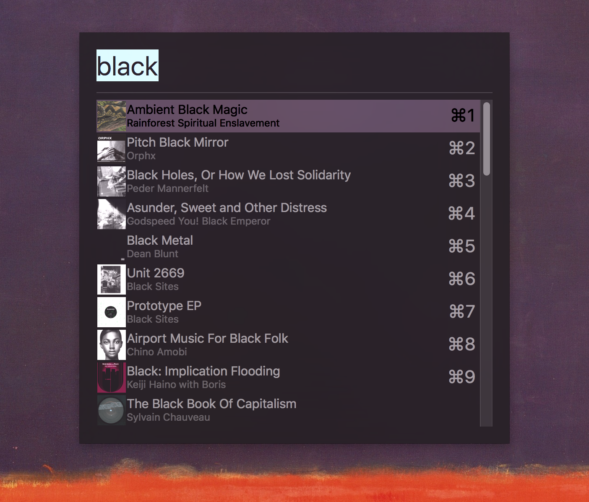

# SqueezeVelocity
Fuzzy search your music collection. For Logitech Media Server 7.6+ and Hammerspoon



## Usage
Unzip spoon in `~/.hammerspoon/Spoons`

```
hs.settings.set("squeezeconfig",
                {serverURL = "http://192.168.178.20:9002/",
                 playerId = "00:00:00:00:00:00",
                 albumCoversEnabled = false}) -- enabling slows down startup when library is big
sqz = hs.loadSpoon("SqueezeVelocity")
sqz:start()
sqz:bindHotKeys({show={{"cmd", "ctrl" }, "P"}})
```
